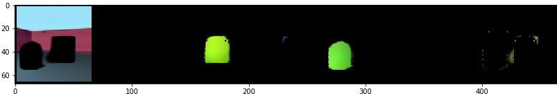
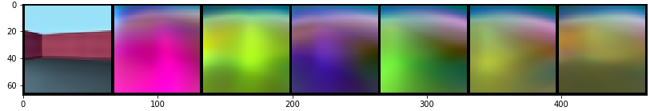

# genesis.pytorch

A PyTorch implementation of [GENESIS: Generative Scene Inference and Sampling](https://arxiv.org/abs/1907.13052). The official implementation by the authors is available [here](https://github.com/applied-ai-lab/genesis).

## Examples

## Data

I used the GQN rooms-ring-camera dataset downloaded from this [Deepmind repo](https://github.com/deepmind/gqn-datasets). You can download the train/test split of 1M/1K I used as an HdF5 file (49 GB) from [Dropbox](https://www.dropbox.com/s/8cknxnh9aso8zk4/images.hdf5?dl=0).

## Installation

`git clone https://github.com/pemami4911/genesis.pytorch.git`

## Dependencies

I'm using Ubuntu 16.04

* Python==3.7
* sacred==0.7.5
* PyTorch==1.2
* tqdm==4.36.1
* h5py==2.9.0

If you're on Linux, you can do `conda env create -f environment.yml`

## Training

`python train_genesis.py with dataset.data_path='YOUR_DATA_PATH' seed=123 training.run_suffix=train_run_1`. See `train_genesis.py` for other run-time arguments.

You can check the hyperparameters I used for `rooms_ring_camera` in `train_genesis.py` and `model.py`. It takes about 2 days to do 500K steps on 1 gpu, but you can train for longer.

## Evaluation

The trained model used to generate the examples is available under `weights/`. You can create similar plots as in the examples with `./scripts/eval_genesis.sh`.

## Some notes

### GECO

My implementation of GECO is in `utils.py`. I had to use a couple of hacks to get this to not cause the network weights to explode. I don't use the exponential update rule, and I apply a `softplus` to beta while computing the GECO loss. I use a warm-start to allow the reconstruction term to ``stabilize'' before beginning to update beta, and I only update beta once every T steps. These hyperparameters are set in `train_genesis.py`.

### Gradient clipping

Since the GECO loss can be on the order of `1e5` and `1e6`, it's important to use some amount of grad norm clipping. You can be as aggressive with this as you want but I ended up using something like a threshold of `1e3`.

### Scale param for foregound and background

The authors use `0.7` for the fixed scale parameter for all slots. I followed MONET and used `0.09` and `0.11` for background and foreground resp. This helps the network to quickly learn to separate background and foreground.

### Initialization

I also followed MONET in using truncated normal weight initialization. See `utils.py` for details.

## Acknowledgements

Special thanks to Martin Engelcke for assistance with implementation details.
