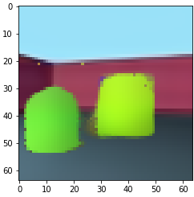

# genesis.pytorch

A PyTorch implementation of [GENESIS: Generative Scene Inference and Sampling](https://arxiv.org/abs/1907.13052). The official implementation by the authors is available [here](https://github.com/applied-ai-lab/genesis).

## Examples

## Data

I used the GQN rooms-ring-camera dataset. I downloaded the data from the [Deepmind repo](https://github.com/deepmind/gqn-datasets) and stored a train/test split of 1M/1K into an HdF5 file (46 GB). It can be downloaded from here: (dropbox link).

## Installation

Tested on Ubuntu 16.04

Dependencies:

* Python 3
* sacred
* PyTorch

Instructions:

* Clone into the repo
* On Linux, install deps via environment.yml

## Training

`python train_genesis.py with dataset.data_path='YOUR_DATA_PATH'`

You can check the hyperparameters I used for rooms_ring_camera in train_genesis.py and model.py. It takes about 2 days to get to 500K steps, but you may want to train longer to let the KL drop farther.

## Evaluation

The trained model used to generate the examples is available under `weights/`. You can create similar figures with `./scripts/eval_genesis.sh`.

## General notes

* GECO
* Gradient clipping
* NaNs
